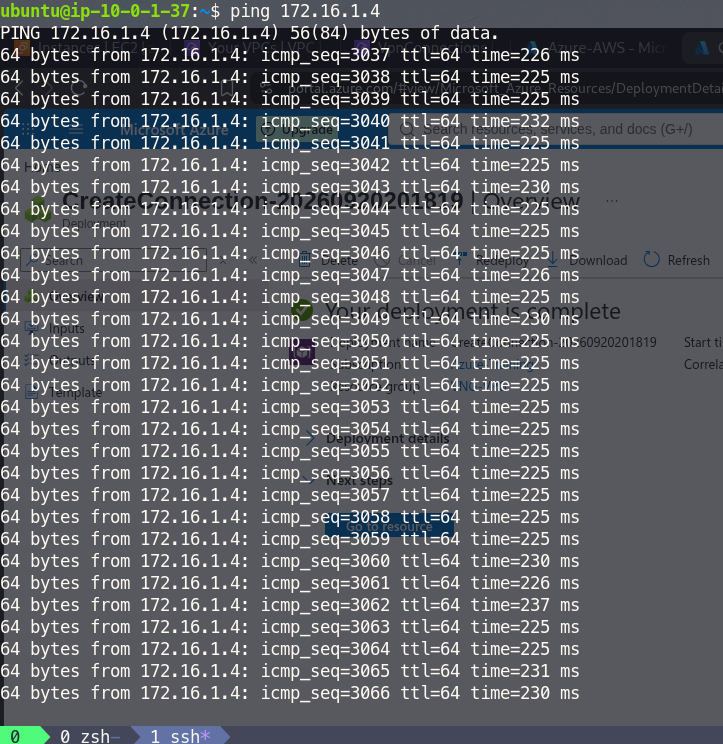
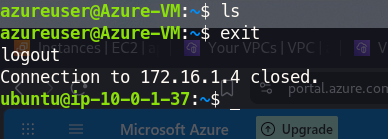

# AZURE

**Index of Content**

1. [Azure Account Creation](https://github.com/106-Sam/DevOps/tree/main/AZURE#1-azure-account-creation)
2. [VPN Gateway for connection between the AWS & Azure Machine](https://github.com/106-Sam/DevOps/tree/main/AZURE#2-vpn-gateway-for-connection-between-the-aws--azure-machine)

## 1. Azure Account Creation

https://portal.azure.com

Things needed to activate subscriptions Free trial: $200 credits (30 days free trial but all services are free)

Incase we have student emails Azure provides 1 year access

1. Credit Card / Debit Card [Salary account] : Visa  or Master card only
2. click on Try Azure for Free
3. Select personal use and provide all the details and bank details it activate then
4. Check the subscription activate or not by searching subscription and notification alert of $200 credits

| AWS | AZURE |
| --- | --- |
| None (we need to delete resources one by one if created) | Resource Group (all our resource will be in this folder and we can delete it all at once) |
| VPC | Vnet |
| Subnet | Subnet |
| Internet Gateway | None |
| Route table | None |
| Security Group (SG) | Network Security Group (NSG) |
| EC2 | VM |

VPN Gateway (VNG) takes 40-60 mins to be created

## 2. VPN Gateway for connection between the AWS & Azure Machine 

Step1: create Resource group under a region

      -  Search for Resource Group > Create a resource group > Select Subscription > Type Resource group name "name123" > create.

Step2: Under same resource group:  add virtual Network (Vnet) & Subnet

      -  Search for Virtual Network (Vnet) > Create >select the "name123" resource group & subscription.
      -  In Address space tab starting address to any Private IP CIDR. 
      -  It automatically create a default subnet > Create.

Step3: Create a dedicated subnet for Virtual Network Gateway (VNG)

      -  Open the created VNG > subnets > create subnets 
      -  In subnet purpose, select Virtual Network Gateway (VNG) > Add

Step4: Create Virtual Machine

      - Search for Virtual Machine > Create > select Sub & Resource Group > VM name > Region >
      -  Availablity zone = No Infrastructure redundancy required.
      -  Security Type = Standard
      -  Image = Ubuntu
      -  Size = 1 CPU, 2 GiB
      -  Authentication type = password or SSH Public Key 
      -  Username = name123
      -  password = kdfakjd, confirm password = dfdajfdkj
      -  Inbound port = 22 
      -  Disk tab = default
      -  Networking tab = Virtual network = name123, subnet = default 
      -  Public IP = Disable (none)
      -  NIC = Basic
      -  Public Inbound Ports = 22 
      -  Create VM
  
Step5: Create the VNG (Virtual Network Gateway) on your Azure Portal

      - Search "Virtual Network Gateway" > under VPN Gateway dropdown > select VPN gateway option (left side column)
      - Create VNG > "name123" > SKU = VpnGw1AZ > select the Virtual Network = the Vnet (created by us before)
      -  It automatically provide the Gateway subnet 
      -  Public IP address > create new  & provide its name 
      -  Disable remaining things below this 
      -  This take minimum 40-60 mins to create this VNG.
  
Step6 to Step8 - in AWS - [click here](https://github.com/106-Sam/DevOps/blob/main/AWS/README.md#20-vpn--connection-between-azure--aws-machines)

Step9: Service Configuration for AZURE VNG to work

Azure: 
      
         1. local network gateway: AWS VPG Public IP address & AWS VPC IP address range.
   
            - select Resource, Subsciption & Region.
            - Name > Endpoint = IP address 
            - IP address = AWS Site to Site VPN Connection > select the VPG & download configuration. In downloaded config file, we can see Ip address 
            - Address Space(s): VPC Ip address range > Create.
  
         2. Site to Site connection

            - existed VNG > Settings > Connections > Add 
            - Select subscription, Resource name & Region.
            - Instance detaisl > Connection type = Site to Site (IPSec)
            - set Virtual Network Gateway (VPG) & Local network gateay
            - Authentication method =  Shared Keys (PSK) [We'll find it in the Configuration file we downloaded under the IP ] > Create
  

Hence, we connected the EC2 to the VM 

